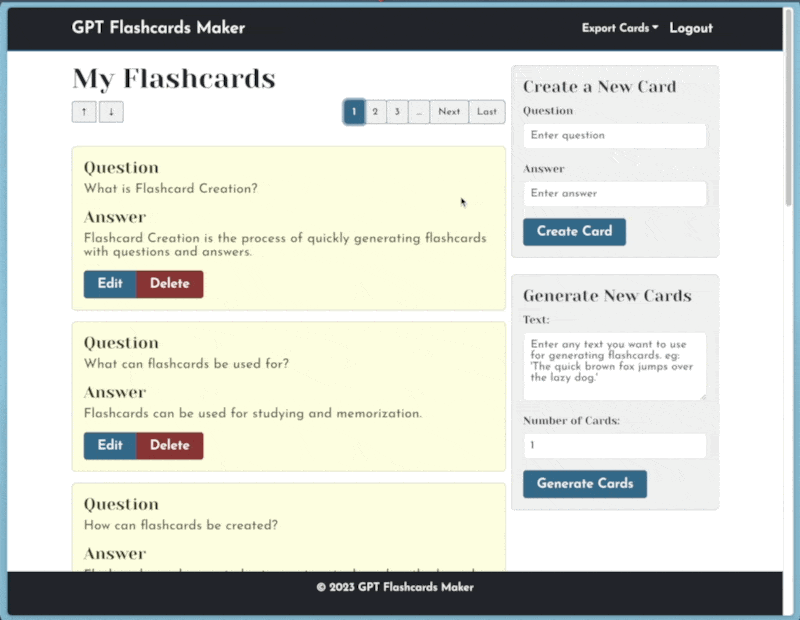
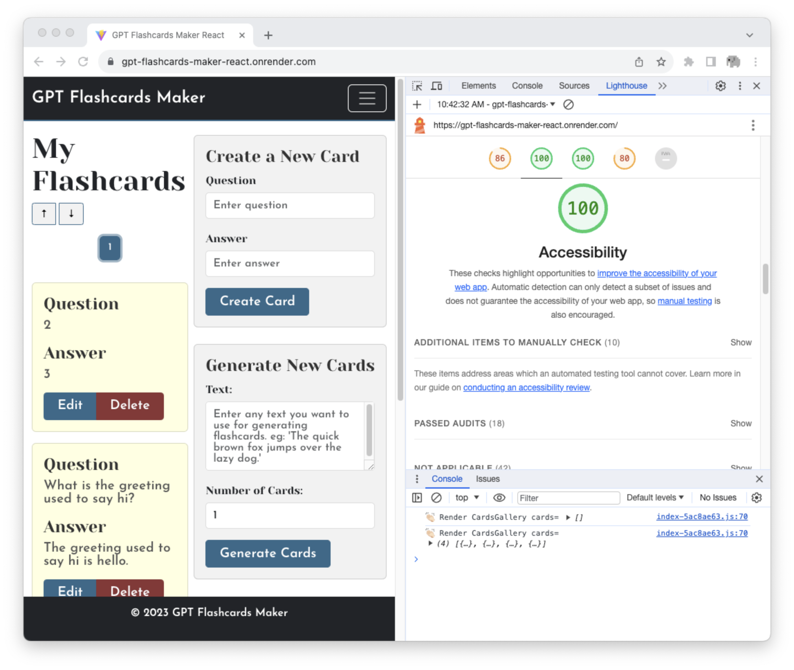
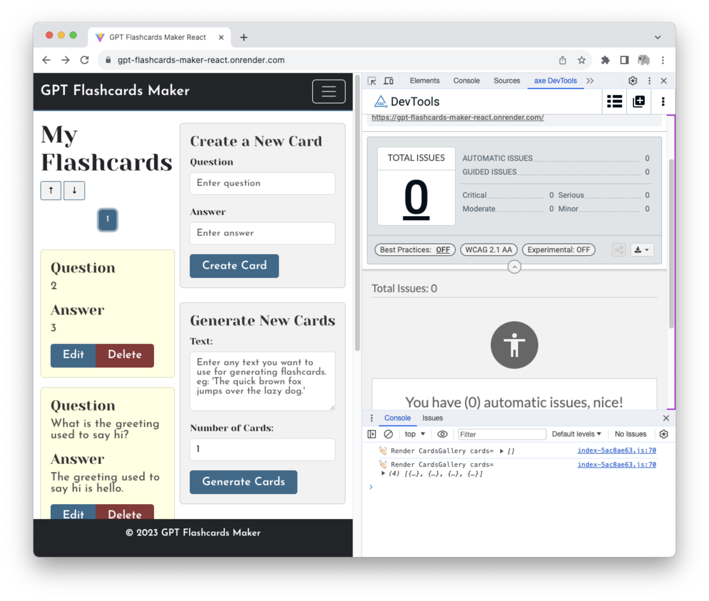

# GPT-flashcards-maker-React

Welcome to GPT FlashCards Maker, a web application designed to simplify the creation of flashcards using the OpenAI GPT API. This project is built using React, Express and MongoDB, allowing you to create and manage flashcards with ease.


## Table of Contents

- [GPT-flashcards-maker-React](#gpt-flashcards-maker-react)
  - [Table of Contents](#table-of-contents)
  - [Introduction](#introduction)
  - [Features](#features)
  - [Final Project Update Features](#final-project-update-features)
  - [Design Document](#design-document)
  - [Color Palette](#color-palette)
  - [Typography Matching](#typography-matching)
  - [Usability Report](#usability-report)
  - [Accessibility Tests](#accessibility-tests)
  - [Demo](#demo)
  - [Installation](#installation)
  - [Usage](#usage)
  - [Technologies](#technologies)
  - [License](#license)

## Introduction

GPT FlashCards Maker React is a powerful tool for creating flashcards. It leverages the OpenAI GPT API to make the flashcard creation process more efficient and user-friendly. Whether you're a student or a professional, this application will help you generate and organize flashcards for effective learning. This is also the first project of [CS5610 Web Development course](https://johnguerra.co/classes/webDevelopment_fall_2023/) at Northeastern University.

## Features

- **Flashcard Creation**: Quickly generate flashcards with questions and answers.
- **Easy Organization**: Create, edit, and delete flashcards with a user-friendly interface.
- **OpenAI GPT Integration**: Utilizes the OpenAI GPT API for generating flashcards from text.
- **Export**: Download your flashcards for offline use or sharing with others.
- **Responsive Design**: Access your flashcards from any device with a responsive web interface.

## Final Project Update Features

- **Auto-Disappearing Error Messages**: Enhanced error messaging improves user experience. Error alerts now automatically vanish after a few seconds, preventing them from obstructing the view and ensuring a cleaner interface.
- **Operation-Dependent Button Disabling**: To improve user interaction, buttons for creating and generating cards are now disabled during processing. This change prevents multiple submissions and clearly indicates when an operation is in progress, enhancing usability.
- **Expanded Export Functionality**: Users now have more flexibility with the export feature. In addition to JSON, the system supports exporting cards in CSV format. This addition caters to different user needs and preferences, making data handling more versatile.
- **Redesigned Website Interface**: The website has undergone a comprehensive redesign. This update includes a new color palette and typography choices, aiming for a more visually appealing and accessible user experience. Minor improvements have also been made across the platform to enhance overall usability and accessibility.

## Design Document

See the [Design Document](./deisgn-document.md) file for details.

## Color Palette

The GPT Flashcards Maker employs a distinctive color palette:

- Success: #8a8834 - A greenish hue for positive feedback.
- Danger: #8a3435 - A reddish hue for warnings and errors.
- Primary: #34698a - A calming blueish hue for main elements.
- NavBar & Footer: #262f35 - Dark gray for contrast and modern look.
- Card Background: #ffffe0 - Cream color for readability and warmth.

These colors enhance the application's aesthetics and user experience.

## Typography Matching

GPT Flashcards Maker employs two fonts for a blend of clarity and elegance:

- [Josefin Sans](https://fonts.google.com/specimen/Josefin+Sans): A geometric sans-serif font providing clarity and modern simplicity for body text and navigation.
- [Yeseva One](https://fonts.google.com/specimen/Yeseva+One): A stylish serif font used for headings and titles, adding elegance and distinctiveness.
  This mix ensures readability while enhancing the visual appeal of the site.

## Usability Report

The usability of GPT Flashcards Maker has been thoroughly evaluated. For the complete analysis, refer to the [Usability Report](https://docs.google.com/document/d/1v2r-lXetH0ebWcA2A4lWNdP5FflcLiQQa0oZsX8DClk/edit?usp=sharing).

## Accessibility Tests

1. lighthouse
   
2. axe DevTools
   

## Demo

You can access the live demo of GPT FlashCards Maker at [Demo Link](https://gpt-flashcards-maker-react.onrender.com/).

## Installation

To run this project locally, follow these steps:

1. Clone this repository:

   ```bash
   git clone https://github.com/ldgze/GPT-flashcards-maker-react
   ```

2. Navigate to the project directory:

   ```bash
   cd gpt-flashcards-maker-react
   ```

3. Install back-end project dependencies using npm:

   ```bash
   $ npm install
   ```

4. Make a copy of the example environment variables file

   On Linux systems:

   ```bash
   $ cp .env.example .env
   ```

   On Windows:

   ```powershell
   $ copy .env.example .env
   ```

5. Add your [API key](https://platform.openai.com/account/api-keys) to the newly created `.env` file
6. Add your [MongoDB Atlas Connection String](https://www.mongodb.com/docs/drivers/node/current/quick-start/create-a-connection-string/) to the newly created `.env` file

7. Run the back-end server

   ```bash
   $ npm start
   ```

8. Open a new terminal. Navigate to the front directory:

   ```bash
   cd front
   ```

9. Install front-end project dependencies using npm:

   ```bash
   $ npm install
   ```

10. Build the front end react application:
    ```bash
    $ npm run build
    ```

You should now be able to access the app at [http://localhost:3000](http://localhost:3000)!

## Usage

Create flashcards by providing questions and answers.
Utilize the OpenAI GPT API to generate flashcards from text.
Organize your flashcards for efficient studying.
Download flashcards for offline use or sharing.

## Technologies

React
Express.js
MongoDB
OpenAI GPT API
HTML, CSS, JavaScript
Bootstrap

## License

This project is licensed under the MIT License. See the LICENSE file for details.
