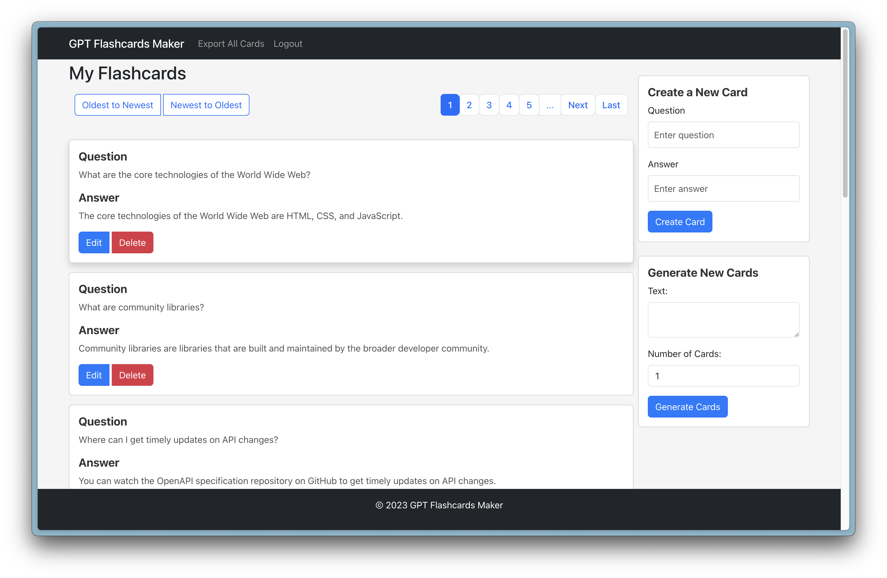
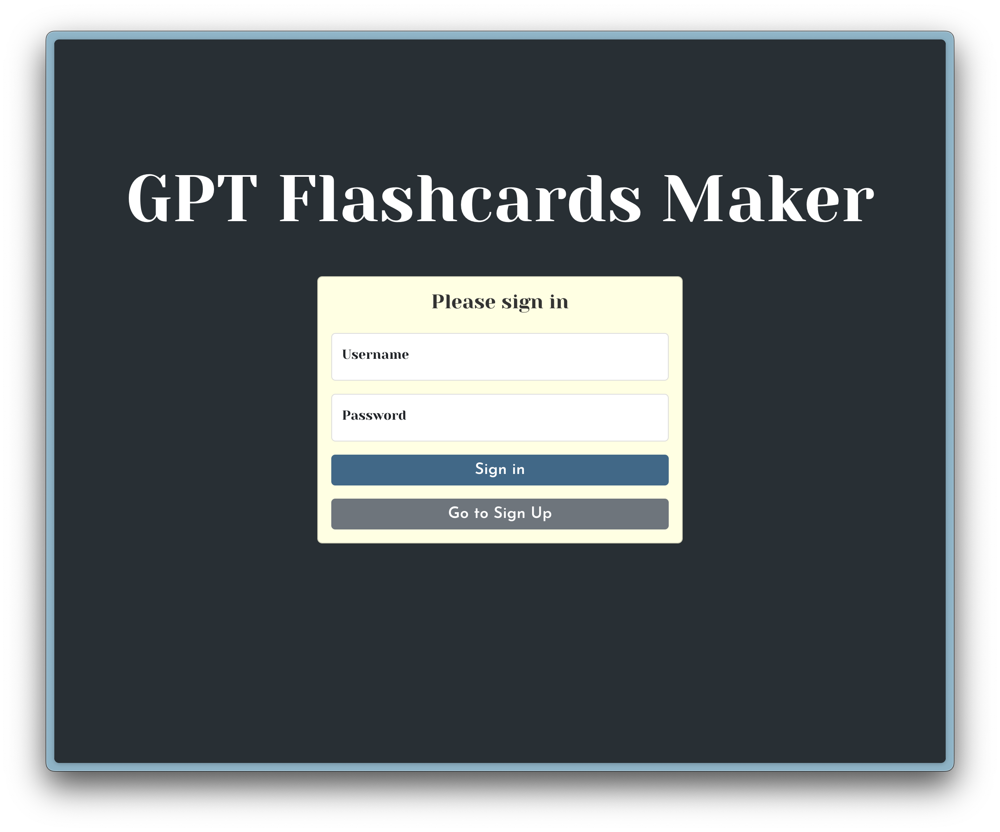

# Design Document for GPT Flashcards Maker React

---

## Project Description

The GPT Flashcards Maker React is a digital platform designed to facilitate users in creating, editing, and managing flashcards for various subjects. Through an intuitive interface, users can generate flashcards with questions and answers, organize them by topics, and even export the data for further use. The platform also includes user account management features.

---

## User Personas

### **Persona 1: College Student - Sarah**

- **Age:** 20
- **Occupation:** College student majoring in Computer Science.
- **Needs:** A way to quickly create and revise flashcards for her upcoming exams.
- **Goals:** To achieve better grades through efficient revision techniques.

### **Persona 2: High School Teacher - Mr. Anderson**

- **Age:** 40
- **Occupation:** High School History Teacher.
- **Needs:** A platform to create flashcards for his students to help them with their revision.
- **Goals:** Improve student engagement and comprehension of historical events.

### **Persona 3: Lifelong Learner - Raj**

- **Age:** 32
- **Occupation:** Software Developer.
- **Needs:** A way to constantly learn and revise new programming languages.
- **Goals:** To keep updated with the latest technological trends.

---

## User Stories

1. **As Sarah**, I want to be able to create flashcards easily so that I can quickly input all the topics I need to cover.
2. **As Sarah**, I want to be able to edit or delete any mistakes on my flashcards to ensure accuracy.
3. **As Mr. Anderson**, I want the ability to organize my flashcards into different topics or subjects so that I can easily find and distribute them to my students.
4. **As Raj**, I want a feature to export all my flashcards into a printable format or a digital file so I can share or review them offline.
5. **As a user**, I need a secure way to log into my account to ensure my flashcards remain private.
6. **As a user**, I want a simple, intuitive interface to ensure my experience with the application is smooth and efficient.

---

## Design Mockups

### **Homepage**:

- Navigation bar at the top with options for 'Home', 'My Flashcards', 'Account Options', and 'Log Out'.
- A main area showcasing a list of previously created flashcards with the option to edit or delete.
- A sidebar for creating new flashcards with fields for 'Question' and 'Answer'.
- A section at the bottom for exporting all flashcards.

### **Login Page**:

- Clean design with fields for entering a 'Username' and 'Password'.
- Options for 'Register' for new users and 'Forgot Password' for those who need to reset their credentials.
